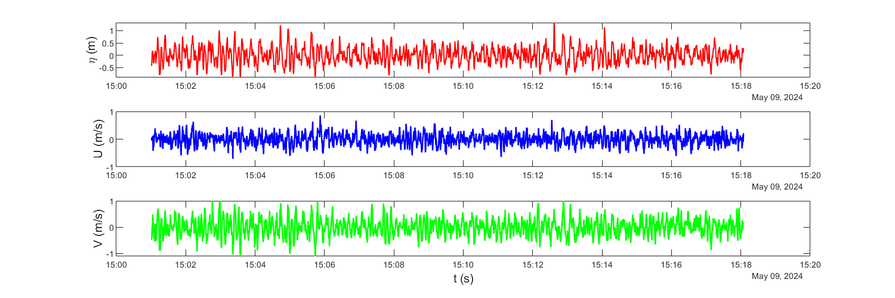
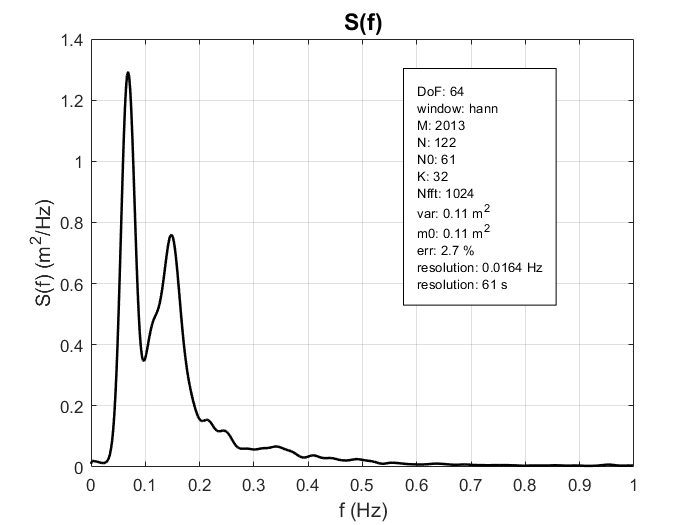
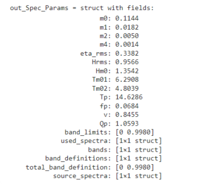
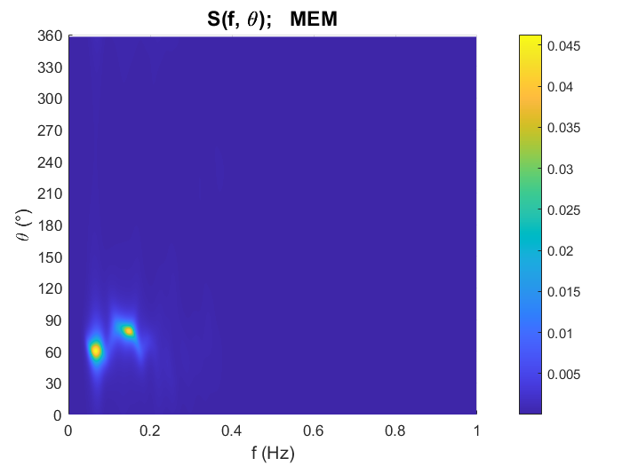
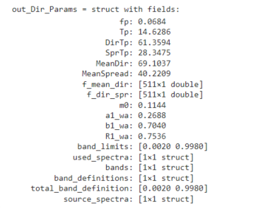

# Wave Spectral Analysis 
[](https://www.mathworks.com/matlabcentral/fileexchange/183891-wave-spectral-analysis)     [](https://doi.org/10.5281/zenodo.20805516)  [](https://deepwiki.com/DG28828/waveSpectralAnalysis)  [](https://github.com/DG28828/waveSpectralAnalysis/blob/main/README.md)


Toolbox de MATLAB para análisis espectral y direccional de oleaje. Incluye
herramientas para estimar espectros de energía, calcular parámetros
espectrales y direccionales, reconstruir espectros direccionales y procesar
datos crudos de instrumentos AWAC, AQUADOPP y RBR.

**v2.0.0 (pre-release):** esta versión amplía el flujo instrumental de la
versión v1.2.0, que incluye únicamente AWAC, con soporte para AQUADOPP
y RBR y funciones comunes de escritura a NetCDF y preprocesamiento.

## Características

- Estimación de espectros unilaterales de energia mediante el método de Welch-Bartlett (periodogramas medios con solapamiento).
- Corrección hidrodinámica para señales de presión usando el factor `Kp`.
- Cálculo de parámetros espectrales por espectro total y por bandas de
  frecuencia.
- Estimación de coeficientes direccionales y espectros direccionales con
  serie de Fourier truncada y método MEM-I (Lygre & Krogstad).
- Cálculo de parámetros direccionales por bandas.
- Conversión de convención cartesiana-hacia a convencion náutica-desde.
- Lectura y control de calidad de datos AWAC, AQUADOPP y RBR, con limpieza
  automática o manual de bursts (ráfagas de medición).
- Escritura a NetCDF y preprocesamiento comunes para los tres instrumentos,
  según la disponibilidad de presión, velocidades orbitales y AST.

## Funciones principales

### Procesamiento espectral y direccional

| Función | Descripción |
| --- | --- |
| `wsa_spectrum` | Estima espectros de energía para superficie libre o presión. |
| `wsa_spectral_parameters` | Calcula parámetros espectrales totales y por bandas de frecuencia. |
| `wsa_dirspectrum` | Estima espectros direccionales con 2 métodos: Serie de Fourier Truncada (TFS) y MEM-I. |
| `wsa_directional_parameters` | Calcula parámetros direccionales totales y por bandas de frecuencia. |
| `wsa_cartto2nautfrom` | Convierte direcciones a convencion náutica-desde. |

### Lectura, limpieza y preprocesamiento de instrumentos

| Función | Descripción |
| --- | --- |
| `wsa_awac_read` | Lee datos crudos AWAC. |
| `wsa_awac_clean` | Limpia bursts AWAC según control de calidad. |
| `wsa_aquadopp_read` | Lee datos AQUADOPP y organiza los bursts diagnósticos con banderas de control de calidad. |
| `wsa_aquadopp_clean` | Elimina bursts AQUADOPP según control de calidad o índices manuales. |
| `wsa_rbr_read` | Lee bursts de presión RBR y metadatos exportados por Ruskin, con control de calidad. |
| `wsa_rbr_clean` | Elimina bursts RBR según control de calidad o índices manuales. |
| `wsa_nc_write` | Escribe datos crudos o limpios de AWAC, AQUADOPP o RBR a formato NetCDF. |
| `wsa_nc_preprocess` | Identifica el instrumento y preprocesa las señales disponibles en el NetCDF. |

Nota: Flujo de AWAC probado con AWAC 1Mhz de Primera Generación.

## Ejemplos de uso

Ejemplos detallados de uso se pueden encontrar como Live Scripts .mlx en la carpeta \toolbox\examples. A continuación se muestra un ejemplo de resumen.

### Datos de entrada
Para el ejemplo se incluyeron datos de ejemplo en la carpeta \toolbox\example_data.
```matlab
data = load('..\example_data\burst_data.mat');
AST = data.burst_data.processed.ast(:, 1);                    %Elevación de la superficie libre
U = data.burst_data.processed.velocity_enu(:, 1);             %Velocidad orbital en X.
V = data.burst_data.processed.velocity_enu(:, 2);             %Velocidad orbital en Y.

fs = data.burst_data.general.fs;                              %Frencuencia de muestreo
ast_mean = data.burst_data.general.ast_mean;                  %Nivel medio medido desde el equipo
cell_position = data.burst_data.general.cell_position;        %Distancia de la cabeza del equipo a la celda de medición de velocidades orbitales.
mounting_height = data.burst_data.general.mounting_height;    %Altura de montaje del equipo.

h   = ast_mean + mounting_height;                             %Profundidad del lecho marino.                                          
z_v = cell_position - ast_mean;                               %Profunidad de medición de las velocidades orbitales.
```
<p align="center">
  
</p>


### Espectro frecuencial
```matlab
[out_Spec, info_Spec] = wsa_spectrum(AST, fs, 'DoF', 64);
f = out_Spec.f;
S = out_Spec.S;
```
<p align="center">
  
</p>


### Parámetros espectrales

```matlab
out_Spec_Params = wsa_spectral_parameters(out_Spec)
```
<p align="center">
  
</p>


### Espectro direccional
```matlab
[out_DirSpec, info_DirSpec] = wsa_dirspectrum(AST, U, V, fs, 'SUV', ...
                                             'z_v', z_v, ...
                                             'h', h);
f = out_DirSpec.MEM.f;
theta = out_DirSpec.MEM.theta;
E = out_DirSpec.MEM.E;
```
<p align="center">
  
</p>


### Parámetros direccionales
```matlab
out_Dir_Params = wsa_directional_parameters(out_DirSpec.MEM)
```
<p align="center">
  
</p>


## Instrumentos

El flujo de trabajo consta de lectura, limpieza de bursts, escritura a NetCDF
y preprocesamiento. La lectura y la limpieza son específicas de cada
instrumento; `wsa_nc_write` y `wsa_nc_preprocess` son comunes a los tres.

### AWAC

El toolbox incluye funciones para trabajar con datos crudos de AWAC:

```matlab
data = wsa_awac_read("...\datos_crudos\");
data_clean = wsa_awac_clean(data);
mounting_height = 0.50; % Ejemplo en m: sustituir por la altura real respecto al fondo.
wsa_nc_write(data_clean, "data_clean.nc", 'mounting_height', mounting_height);
info = wsa_nc_preprocess("data_clean.nc");
```

Funciones principales:

- `wsa_awac_read`: lee archivos desencriptados `.hdr`, `.whd` y `.wad`, construye un struct con los datos de la campaña y genera banderas de control de calidad de los estados de mar.
- `wsa_awac_clean`: en el modo automático elimina bursts marcados en la lectura o permite ingresar indices manualmente.
- `wsa_nc_preprocess`: para AWAC, corrige y combina señales AST, transforma velocidades orbitales a ejes geográficos ENU, filtra señales y agrega variables procesadas al NetCDF.

### AQUADOPP

- `wsa_aquadopp_read`: lee archivos `.hdr`, `.dat` y `.dia`. Utiliza el formato
  de columnas descrito en el `.hdr` y organiza las señales de presión y
  velocidad del `.dia` en bursts diagnósticos. Verifica el número de muestras,
  la orientación del instrumento y la presión.
- `wsa_aquadopp_clean`: elimina bursts diagnósticos según las banderas de
  calidad o índices manuales. Conserva los registros regulares del `.dat`,
  que no corresponden uno a uno con los bursts del `.dia`.
- `wsa_nc_preprocess`: procesa presión y velocidades. Conserva las velocidades si ya están en ENU o transforma
  desde BEAM cuando dispone de la matriz de transformación y la orientación.
  La transformación desde XYZ no está implementada.


```matlab
data = wsa_aquadopp_read("...\datos_aquadopp\");
data_clean = wsa_aquadopp_clean(data);
mounting_height = 0.50; % Ejemplo en m: sustituir por la altura real respecto al fondo.
wsa_nc_write(data_clean, "aquadopp_clean.nc", 'mounting_height', mounting_height);
info = wsa_nc_preprocess("aquadopp_clean.nc");
```

**Alcance de esta implementación:** la lectura fija el muestreo diagnóstico
en 1 Hz. El preprocesamiento calcula la posición de la celda de velocidad
como `blanking_distance + 1.5 * 0.75` m. Estas suposiciones deben coincidir
con la configuración de los datos utilizados; no se ajustan automáticamente
a cualquier configuración AQUADOPP.

### RBR

- `wsa_rbr_read`: lee un par de archivos `*_metadata.txt` y `*_burst.txt`
  exportados por Ruskin, con el mismo nombre base. El archivo de metadatos
  debe ser JSON y el de bursts debe comenzar con las columnas
  `Time,Burst,Pressure`. La presión se importa en dbar como presión absoluta.
  Se verifican el número de muestras, el intervalo temporal dentro de cada
  burst y la calidad de la presión.
- `wsa_rbr_clean`: elimina bursts según las banderas de calidad o índices
  manuales. En esta versión recibe el struct generado por `wsa_rbr_read`;
  no admite reconstruirlo desde un archivo NetCDF.
- `wsa_nc_preprocess`: convierte la presión absoluta a manométrica restando
  la presión atmosférica guardada en los metadatos de Ruskin, calcula la
  profundidad y preprocesa la señal de presión. Usa la densidad de Ruskin
  cuando está disponible; en caso contrario utiliza 1025 kg/m³.

No se utilizan los archivos `*_data.txt`, `*_events.txt` ni `*_wave.txt`, ni
la columna derivada `Wave` del archivo de bursts. Este flujo RBR utiliza
solo presión: permite análisis espectral, pero no estimación direccional
por sí solo, al no disponer de velocidades orbitales ni AST.

```matlab
data = wsa_rbr_read("...\datos_rbr\");
data_clean = wsa_rbr_clean(data);
mounting_height = 0.50; % Ejemplo en m: sustituir por la altura real respecto al fondo.
wsa_nc_write(data_clean, "rbr_clean.nc", 'mounting_height', mounting_height);
info = wsa_nc_preprocess("rbr_clean.nc");
```

Los tiempos se leen tal como aparecen en la exportación. El desfase UTC de
Ruskin se conserva como metadato, pero no se aplica automáticamente al
escribir el NetCDF. Para obtener tiempos UTC correctos en este flujo,
utilizar una exportación con las fechas ya expresadas en UTC.

### Escritura y preprocesamiento comunes

- Las funciones `wsa_*_clean` eliminan bursts completos; no corrigen las
  muestras dentro de cada burst. El modo automático utiliza las banderas
  generadas por el lector correspondiente. Para limpieza manual se utilizan
  `'man', true` y `'clean_idx', indices`.
- `wsa_nc_write` identifica el instrumento a partir del struct y guarda
  señales, metadatos y banderas de calidad. Admite `'site_name'`,
  `'campaign_name'`, `'mounting_height'` y `'overwrite'`. La altura de montaje
  se expresa en metros respecto al fondo y es necesaria para obtener una
  profundidad `h` válida. Por defecto, un NetCDF existente se sobrescribe;
  se puede impedir con `'overwrite', false`.
- `wsa_nc_preprocess` identifica el equipo mediante el atributo
  `instrument_type`, remueve media y tendencia, procesa las señales
  disponibles y escribe los resultados en el mismo NetCDF. También devuelve
  el struct `info`. Las variables no aplicables al instrumento se guardan
  con valores de relleno, y su disponibilidad se indica mediante atributos.

Por defecto se aplica un filtro de 1/30 a 1/2 Hz y se generan señales IG
filtradas entre 1/300 y 1/30 Hz. Las opciones `'filter_flag'`,
`'IG_filter_flag'` y `'ast_corr_flag'` permiten controlar estas operaciones;
la corrección AST solo se realiza si existen mediciones AST. Para conservar
en las señales procesadas el contenido fuera de la banda de 1/30 a 1/2 Hz,
utilizar `'filter_flag', false`; la remoción de media y tendencia se mantiene.
El filtrado predeterminado hasta 1/2 Hz requiere un muestreo de al menos 1 Hz.


### Migración desde v1.2.0

- Sustituir `wsa_awac_nc_write` por `wsa_nc_write` y
  `wsa_awac_preprocess` por `wsa_nc_preprocess` en los scripts existentes.
  Los nombres anteriores ya no están incluidos en esta versión.
- Las funciones de instrumentos se encuentran ahora en
  `toolbox/io_instruments`; actualizar los paths configurados manualmente
  o volver a agregar `toolbox` con todas sus subcarpetas.
- Los NetCDF generados por v1.2.0 no son directamente compatibles con el
  nuevo preprocesador: faltan atributos como `instrument_type` y cambian
  nombres de metadatos de muestreo y coordenadas. Volver a exportarlos desde
  los datos crudos o limpios con `wsa_nc_write` antes de preprocesarlos.

## Requisitos

- MATLAB. El toolbox se ha revisado con MATLAB R2024b.
- Signal Processing Toolbox.
- Funciones NetCDF de MATLAB.

## Instalación
Se muestran tres opciones para instalación del toolbox. Se recomienda utilizar la 1 o 2, debido a  que el archivo de toolbox .mltbx resuelve los paths de las funciones de forma automática.

### 1) Desde Matlab File Exchange
En Matlab, ir a la pestaña Home, y abrir Get Add-Ons. Buscar el toolbox como Wave Spectral Analysis e instalar o descargar el archivo de toolbox .mltbx. Al usar este método se descarga el último release publicado en GitHub.

### 2) Desde el release de Github
Descargar el release de interés, luego ejecutar el archivo de toolbox .mltbx o usar el código fuente. En el segundo caso, se deben agregar las funciones al path como se detalla en la opción 3.

### 3) Descargando el código fuente

Clonar o descargar el repositorio y agregar la carpeta `toolbox` con todas sus
subcarpetas al path de MATLAB:

```matlab
addpath(genpath("...\waveSpectralAnalysis\toolbox"))
```

Para verificar que el path quedo correctamente configurado:

```matlab
which wsa_spectrum
which wsa_psdwb
```

Ambos comandos deben devolver rutas dentro de la carpeta `toolbox`.


## Convenciones y notas

- Las frecuencias se expresan en Hz.
- Las profundidades de sensores bajo el nivel medio se indican con signo
  negativo, por ejemplo `z_p = -0.5`.
- En `wsa_spectrum`, la señal se preprocesa removiendo media y tendencia antes
  de estimar el espectro.
- En el análisis direccional, la componente de frecuencia cero se excluye del
  análisis direccional.
- Las direcciones de `wsa_dirspectrum` y `wsa_directional_parameters` usan por
  defecto convencion cartesiana-hacia (angulos positivos medidos desde el eje X positivo en dirección contraria a las manecillas del reloj).
- Se asume que las velocidades orbitales X e Y de entrada corresponde a las coordenadas geográficas Este y Norte, respectivamente. Con valores positivos medidos hacia el Este y Norte.

## Licencia

Este proyecto se distribuye bajo la licencia incluida en `LICENSE`.

